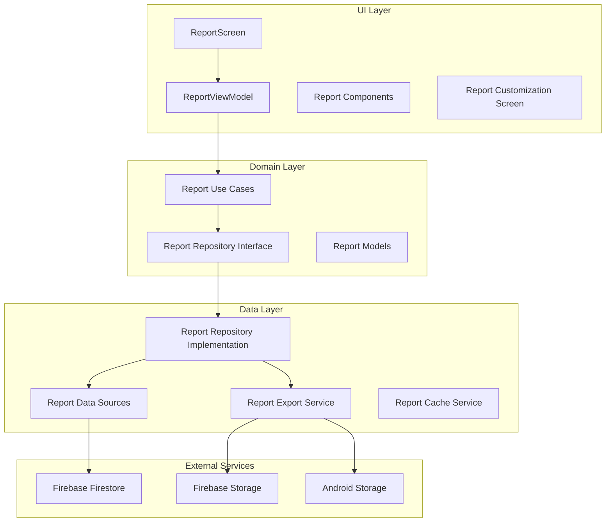

# Static Report Feature Design Document

## Overview

The static report feature will provide users with comprehensive, exportable reports of their learning progress, achievements, and statistics within the Dingo language learning app. This feature integrates seamlessly with the existing Clean Architecture pattern, following MVVM principles and utilizing the established Firebase backend infrastructure.

The feature will be implemented as a new module within the existing UI layer, leveraging the current design system (Mountain Sunrise theme) and component library. Reports will be generated on-demand or scheduled automatically, with multiple export formats and extensive customization options.

## Architecture

### High-Level Architecture



### Module Structure

Following the existing project structure:

```
ui/src/main/java/io/sukhuat/dingo/ui/screens/report/
├── ReportScreen.kt                    # Main report screen
├── ReportViewModel.kt                 # ViewModel for report logic
├── ReportUiState.kt                   # UI state management
├── components/
│   ├── ReportHeader.kt               # Report title and metadata
│   ├── ReportStatistics.kt           # Statistics visualization
│   ├── ReportCharts.kt               # Chart components
│   ├── ReportCustomization.kt        # Theme and layout options
│   ├── ReportExportDialog.kt         # Export format selection
│   ├── ReportScheduling.kt           # Scheduling configuration
│   └── ReportHistory.kt              # Historical reports list
└── models/
    ├── ReportTheme.kt                # Theme definitions
    ├── ReportLayout.kt               # Layout configurations
    └── ReportExportFormat.kt         # Export format options

domain/src/main/java/io/sukhuat/dingo/domain/
├── model/
│   ├── Report.kt                     # Core report model
│   ├── ReportStatistics.kt           # Statistics data model
│   ├── ReportConfiguration.kt        # User customization settings
│   └── ReportSchedule.kt             # Scheduling configuration
├── usecase/report/
│   ├── GenerateReportUseCase.kt      # Generate report logic
│   ├── ExportReportUseCase.kt        # Export functionality
│   ├── ScheduleReportUseCase.kt      # Scheduling logic
│   ├── GetReportHistoryUseCase.kt    # Historical reports
│   └── CustomizeReportUseCase.kt     # Customization logic
└── repository/
    └── ReportRepository.kt           # Repository interface

data/src/main/java/io/sukhuat/dingo/data/
├── repository/
│   └── ReportRepositoryImpl.kt       # Repository implementation
├── model/
│   ├── FirebaseReport.kt             # Firebase data model
│   └── ReportEntity.kt               # Local cache entity
├── service/
│   ├── ReportGenerationService.kt    # Report generation logic
│   ├── ReportExportService.kt        # Export service
│   └── ReportSchedulingService.kt    # Background scheduling
└── cache/
    └── ReportCacheManager.kt         # Local caching
```

## Components and Interfaces

### Core Models

#### Report Domain Model
```kotlin
data class Report(
    val id: String,
    val userId: String,
    val title: String,
    val generatedAt: Long,
    val dateRange: DateRange,
    val statistics: ReportStatistics,
    val configuration: ReportConfiguration,
    val status: ReportStatus = ReportStatus.GENERATED
)

data class ReportStatistics(
    val totalLessonsCompleted: Int,
    val totalStudyTimeMinutes: Int,
    val averageAccuracy: Float,
    val currentStreak: Int,
    val wordsLearned: Int,
    val skillBreakdown: Map<String, SkillStatistics>,
    val dailyActivity: List<DailyActivity>,
    val achievements: List<Achievement>
)

data class ReportConfiguration(
    val theme: ReportTheme,
    val includedSections: Set<ReportSection>,
    val chartTypes: Map<String, ChartType>,
    val colorScheme: ColorScheme,
    val layout: ReportLayout
)

enum class ReportTheme {
    LIGHT, DARK, HIGH_CONTRAST, 
    MEDIEVAL_PARCHMENT, VINTAGE_SCHOLAR, DRAGONS_LAIR
}

enum class ReportSection {
    PROGRESS_METRICS, ACHIEVEMENTS, TIME_ANALYSIS, 
    ACCURACY_BREAKDOWN, STREAK_INFORMATION
}
```

#### Export Models
```kotlin
data class ExportRequest(
    val reportId: String,
    val format: ExportFormat,
    val customization: ExportCustomization? = null
)

enum class ExportFormat {
    PDF, PNG, JSON
}

data class ExportResult(
    val success: Boolean,
    val filePath: String? = null,
    val error: String? = null,
    val fileSize: Long = 0
)
```

### Repository Interface

```kotlin
interface ReportRepository {
    suspend fun generateReport(
        userId: String,
        dateRange: DateRange,
        configuration: ReportConfiguration
    ): Flow<Report>
    
    suspend fun getReportHistory(userId: String): Flow<List<Report>>
    
    suspend fun exportReport(
        report: Report,
        format: ExportFormat
    ): Flow<ExportResult>
    
    suspend fun scheduleReport(
        userId: String,
        schedule: ReportSchedule
    ): Result<String>
    
    suspend fun getScheduledReports(userId: String): Flow<List<ReportSchedule>>
    
    suspend fun updateReportConfiguration(
        userId: String,
        configuration: ReportConfiguration
    ): Result<Unit>
    
    suspend fun deleteReport(reportId: String): Result<Unit>
}
```

### Use Cases

#### Generate Report Use Case
```kotlin
class GenerateReportUseCase @Inject constructor(
    private val reportRepository: ReportRepository,
    private val userProfileRepository: UserProfileRepository,
    private val statisticsRepository: ProfileStatisticsRepository
) {
    suspend operator fun invoke(
        dateRange: DateRange,
        configuration: ReportConfiguration
    ): Flow<Result<Report>> = flow {
        try {
            emit(Result.Loading)
            
            // Gather data from multiple sources
            val userProfile = userProfileRepository.getUserProfile().first()
            val statistics = statisticsRepository.getStatistics(dateRange).first()
            
            // Generate report
            val report = reportRepository.generateReport(
                userId = userProfile.userId,
                dateRange = dateRange,
                configuration = configuration
            ).first()
            
            emit(Result.Success(report))
        } catch (e: Exception) {
            emit(Result.Error(e))
        }
    }
}
```

#### Export Report Use Case
```kotlin
class ExportReportUseCase @Inject constructor(
    private val reportRepository: ReportRepository,
    private val exportService: ReportExportService
) {
    suspend operator fun invoke(
        report: Report,
        format: ExportFormat
    ): Flow<ExportResult> = flow {
        try {
            emit(ExportResult(success = false)) // Loading state
            
            val result = when (format) {
                ExportFormat.PDF -> exportService.exportToPdf(report)
                ExportFormat.PNG -> exportService.exportToPng(report)
                ExportFormat.JSON -> exportService.exportToJson(report)
            }
            
            emit(result)
        } catch (e: Exception) {
            emit(ExportResult(success = false, error = e.message))
        }
    }
}
```

### UI Components

#### Report Screen
```kotlin
@Composable
fun ReportScreen(
    onNavigateBack: () -> Unit,
    viewModel: ReportViewModel = hiltViewModel()
) {
    val uiState by viewModel.uiState.collectAsState()
    val customizationState by viewModel.customizationState.collectAsState()
    
    DingoScaffold(
        title = stringResource(R.string.reports),
        navigationIcon = { BackButton(onNavigateBack) }
    ) { paddingValues ->
        when (val state = uiState) {
            is ReportUiState.Loading -> LoadingIndicator()
            is ReportUiState.Success -> {
                ReportContent(
                    report = state.report,
                    customization = customizationState,
                    onExport = viewModel::exportReport,
                    onCustomize = viewModel::updateCustomization,
                    onSchedule = viewModel::scheduleReport
                )
            }
            is ReportUiState.Error -> ErrorContent(
                message = state.message,
                onRetry = viewModel::retry
            )
        }
    }
}
```

#### Report Statistics Component
```kotlin
@Composable
fun ReportStatistics(
    statistics: ReportStatistics,
    theme: ReportTheme,
    modifier: Modifier = Modifier
) {
    LazyColumn(
        modifier = modifier,
        verticalArrangement = Arrangement.spacedBy(16.dp)
    ) {
        item {
            StatisticsOverview(
                totalLessons = statistics.totalLessonsCompleted,
                studyTime = statistics.totalStudyTimeMinutes,
                accuracy = statistics.averageAccuracy,
                streak = statistics.currentStreak,
                theme = theme
            )
        }
        
        item {
            ProgressCharts(
                dailyActivity = statistics.dailyActivity,
                skillBreakdown = statistics.skillBreakdown,
                theme = theme
            )
        }
        
        item {
            AchievementsList(
                achievements = statistics.achievements,
                theme = theme
            )
        }
    }
}
```

## Data Models

### Firebase Data Models

```kotlin
data class FirebaseReport(
    @DocumentId val id: String = "",
    @PropertyName("user_id") val userId: String = "",
    @PropertyName("title") val title: String = "",
    @PropertyName("generated_at") val generatedAt: Timestamp = Timestamp.now(),
    @PropertyName("date_range") val dateRange: Map<String, Any> = emptyMap(),
    @PropertyName("statistics") val statistics: Map<String, Any> = emptyMap(),
    @PropertyName("configuration") val configuration: Map<String, Any> = emptyMap(),
    @PropertyName("status") val status: String = "GENERATED"
)

data class FirebaseReportSchedule(
    @DocumentId val id: String = "",
    @PropertyName("user_id") val userId: String = "",
    @PropertyName("interval") val interval: String = "",
    @PropertyName("day_of_week") val dayOfWeek: Int? = null,
    @PropertyName("time_of_day") val timeOfDay: String = "",
    @PropertyName("configuration") val configuration: Map<String, Any> = emptyMap(),
    @PropertyName("is_active") val isActive: Boolean = true,
    @PropertyName("created_at") val createdAt: Timestamp = Timestamp.now()
)
```

### Local Cache Models

```kotlin
@Entity(tableName = "reports")
data class ReportEntity(
    @PrimaryKey val id: String,
    val userId: String,
    val title: String,
    val generatedAt: Long,
    val dateRangeJson: String,
    val statisticsJson: String,
    val configurationJson: String,
    val status: String,
    val cachedAt: Long = System.currentTimeMillis()
)

@Entity(tableName = "report_configurations")
data class ReportConfigurationEntity(
    @PrimaryKey val userId: String,
    val themeJson: String,
    val sectionsJson: String,
    val chartTypesJson: String,
    val colorSchemeJson: String,
    val layoutJson: String,
    val updatedAt: Long = System.currentTimeMillis()
)
```

## Error Handling

### Report-Specific Errors

```kotlin
sealed class ReportError : Exception() {
    object InsufficientData : ReportError()
    object GenerationFailed : ReportError()
    data class ExportFailed(val format: ExportFormat, val reason: String) : ReportError()
    object SchedulingFailed : ReportError()
    data class StorageQuotaExceeded(val requiredSpace: Long) : ReportError()
    object NetworkUnavailable : ReportError()
    data class InvalidConfiguration(val field: String) : ReportError()
}

class ReportErrorHandler {
    fun handleError(error: ReportError): ErrorAction {
        return when (error) {
            is ReportError.InsufficientData -> ErrorAction.ShowInsufficientData
            is ReportError.GenerationFailed -> ErrorAction.ShowRetry
            is ReportError.ExportFailed -> ErrorAction.ShowExportError(error.format, error.reason)
            is ReportError.SchedulingFailed -> ErrorAction.ShowSchedulingError
            is ReportError.StorageQuotaExceeded -> ErrorAction.ShowStorageError(error.requiredSpace)
            is ReportError.NetworkUnavailable -> ErrorAction.ShowOfflineMode
            is ReportError.InvalidConfiguration -> ErrorAction.ShowConfigurationError(error.field)
        }
    }
}
```

### Fallback Strategies

```kotlin
class ReportFallbackManager {
    suspend fun handleInsufficientData(
        dateRange: DateRange
    ): ReportStatistics {
        return ReportStatistics(
            totalLessonsCompleted = 0,
            totalStudyTimeMinutes = 0,
            averageAccuracy = 0f,
            currentStreak = 0,
            wordsLearned = 0,
            skillBreakdown = emptyMap(),
            dailyActivity = emptyList(),
            achievements = emptyList()
        )
    }
    
    suspend fun handleOfflineMode(
        userId: String
    ): List<Report> {
        return reportCacheManager.getCachedReports(userId)
    }
}
```

## Testing Strategy

### Unit Tests

```kotlin
class GenerateReportUseCaseTest {
    @Test
    fun `generate report with valid data returns success`() = runTest {
        // Given
        val mockRepository = mockk<ReportRepository>()
        val useCase = GenerateReportUseCase(mockRepository, mockUserRepo, mockStatsRepo)
        
        // When
        val result = useCase(dateRange, configuration).first()
        
        // Then
        assertTrue(result is Result.Success)
    }
    
    @Test
    fun `generate report with insufficient data shows appropriate message`() = runTest {
        // Test insufficient data handling
    }
}

class ReportViewModelTest {
    @Test
    fun `export report updates UI state correctly`() = runTest {
        // Test ViewModel state management
    }
}
```

### Integration Tests

```kotlin
@HiltAndroidTest
class ReportIntegrationTest {
    @Test
    fun `end to end report generation and export`() {
        // Test complete flow from generation to export
    }
    
    @Test
    fun `scheduled report generation works correctly`() {
        // Test background scheduling
    }
}
```

### UI Tests

```kotlin
@Composable
class ReportScreenTest {
    @Test
    fun `report screen displays statistics correctly`() {
        // Test UI rendering
    }
    
    @Test
    fun `export dialog shows correct format options`() {
        // Test export functionality
    }
    
    @Test
    fun `customization options update report appearance`() {
        // Test theme and layout changes
    }
}
```

### Performance Tests

```kotlin
class ReportPerformanceTest {
    @Test
    fun `large report generation completes within acceptable time`() {
        // Test performance with large datasets
    }
    
    @Test
    fun `export operations don't block UI thread`() {
        // Test background processing
    }
}
```

## Implementation Considerations

### Performance Optimization

1. **Lazy Loading**: Load report sections on-demand
2. **Background Processing**: Generate reports in background threads
3. **Caching**: Cache generated reports locally
4. **Pagination**: Paginate historical reports list
5. **Memory Management**: Dispose of large objects after export

### Accessibility

1. **Screen Reader Support**: Proper content descriptions for charts
2. **High Contrast Themes**: Dedicated high contrast theme option
3. **Font Scaling**: Support for system font size preferences
4. **Navigation**: Keyboard navigation support
5. **Alternative Text**: Text alternatives for visual elements

### Internationalization

1. **Localized Strings**: All UI text supports multiple languages
2. **Date Formatting**: Locale-specific date and time formatting
3. **Number Formatting**: Locale-specific number formatting
4. **RTL Support**: Right-to-left language support
5. **Cultural Considerations**: Theme names and colors appropriate for different cultures

### Security and Privacy

1. **Data Encryption**: Encrypt exported files
2. **Access Control**: User-specific report access
3. **Data Retention**: Automatic cleanup of old reports
4. **Privacy Compliance**: GDPR-compliant data handling
5. **Secure Storage**: Secure local storage for cached reports

This design document provides a comprehensive foundation for implementing the static report feature while maintaining consistency with the existing Dingo app architecture and design patterns.