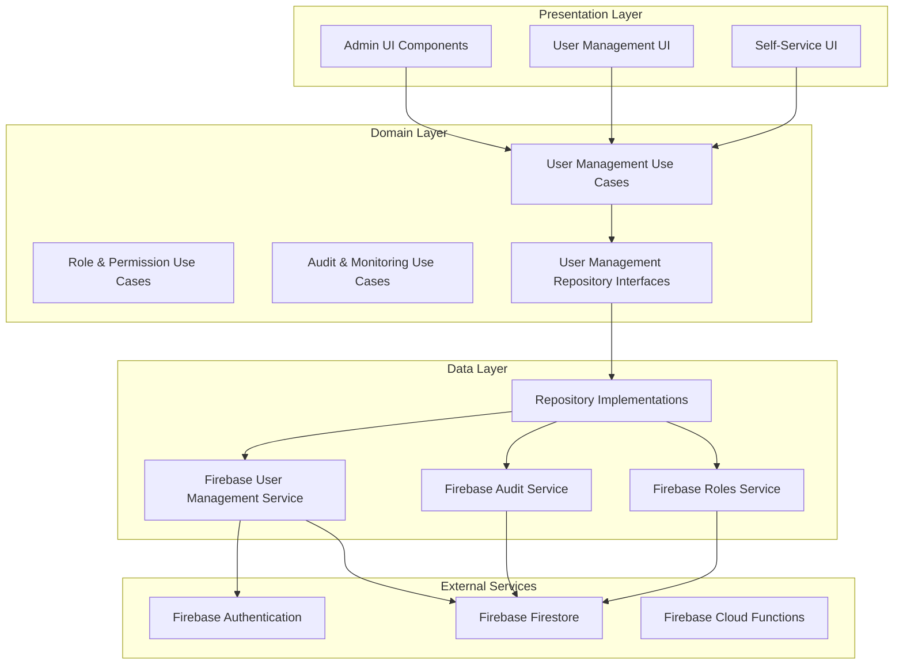

# User Management Design Document

## Overview

The user management system extends the existing Dingo application architecture to provide comprehensive administrative capabilities for managing user accounts, roles, permissions, and system access. The design leverages the current Clean Architecture pattern with MVVM, Firebase backend, and Hilt dependency injection while introducing new components for administrative functionality.

The system will be built as a modular extension that integrates seamlessly with the existing user profile and authentication systems, providing both administrative interfaces and enhanced self-service capabilities for users.

## Architecture

### High-Level Architecture



### Module Integration

The user management system will integrate with existing modules:

- **:domain** - Add new use cases and repository interfaces
- **:data** - Add new repository implementations and Firebase services
- **:ui** - Add new admin screens and components
- **:common** - Add shared components for user management UI

## Components and Interfaces

### Domain Models

```kotlin
// Core user management models
data class ManagedUser(
    val id: String,
    val email: String,
    val displayName: String,
    val roles: List<UserRole>,
    val status: UserStatus,
    val createdAt: Timestamp,
    val lastLoginAt: Timestamp?,
    val isEmailVerified: Boolean,
    val authProvider: AuthProvider,
    val metadata: UserMetadata
)

data class UserRole(
    val id: String,
    val name: String,
    val permissions: List<Permission>,
    val isSystemRole: Boolean,
    val description: String
)

data class Permission(
    val id: String,
    val name: String,
    val resource: String,
    val action: String,
    val description: String
)

enum class UserStatus {
    ACTIVE, INACTIVE, SUSPENDED, PENDING_VERIFICATION
}

data class AuditLog(
    val id: String,
    val userId: String,
    val action: String,
    val resource: String,
    val timestamp: Timestamp,
    val ipAddress: String?,
    val userAgent: String?,
    val details: Map<String, Any>
)
```

### Repository Interfaces

```kotlin
interface UserManagementRepository {
    suspend fun getAllUsers(
        page: Int = 0,
        pageSize: Int = 20,
        filter: UserFilter? = null
    ): Flow<PagingData<ManagedUser>>
    
    suspend fun getUserById(userId: String): Result<ManagedUser>
    suspend fun createUser(userRequest: CreateUserRequest): Result<ManagedUser>
    suspend fun updateUser(userId: String, updates: UserUpdateRequest): Result<ManagedUser>
    suspend fun deleteUser(userId: String): Result<Unit>
    suspend fun changeUserStatus(userId: String, status: UserStatus): Result<Unit>
    suspend fun resetUserPassword(userId: String): Result<String>
    suspend fun bulkImportUsers(users: List<CreateUserRequest>): Result<BulkOperationResult>
    suspend fun exportUsers(filter: UserFilter?): Result<List<ManagedUser>>
}

interface RoleManagementRepository {
    suspend fun getAllRoles(): Flow<List<UserRole>>
    suspend fun getRoleById(roleId: String): Result<UserRole>
    suspend fun createRole(role: CreateRoleRequest): Result<UserRole>
    suspend fun updateRole(roleId: String, updates: UpdateRoleRequest): Result<UserRole>
    suspend fun deleteRole(roleId: String): Result<Unit>
    suspend fun assignRoleToUser(userId: String, roleId: String): Result<Unit>
    suspend fun removeRoleFromUser(userId: String, roleId: String): Result<Unit>
    suspend fun getUserRoles(userId: String): Flow<List<UserRole>>
}

interface AuditRepository {
    suspend fun logUserAction(auditLog: AuditLog): Result<Unit>
    suspend fun getUserAuditLogs(
        userId: String,
        startDate: Timestamp?,
        endDate: Timestamp?
    ): Flow<List<AuditLog>>
    suspend fun getSystemAuditLogs(
        startDate: Timestamp?,
        endDate: Timestamp?,
        filter: AuditFilter?
    ): Flow<PagingData<AuditLog>>
    suspend fun generateComplianceReport(
        startDate: Timestamp,
        endDate: Timestamp
    ): Result<ComplianceReport>
}
```

### Use Cases

```kotlin
// User Management Use Cases
class GetAllUsersUseCase(private val repository: UserManagementRepository)
class CreateUserUseCase(private val repository: UserManagementRepository)
class UpdateUserUseCase(private val repository: UserManagementRepository)
class DeleteUserUseCase(private val repository: UserManagementRepository)
class BulkImportUsersUseCase(private val repository: UserManagementRepository)
class ExportUsersUseCase(private val repository: UserManagementRepository)

// Role Management Use Cases
class GetAllRolesUseCase(private val repository: RoleManagementRepository)
class CreateRoleUseCase(private val repository: RoleManagementRepository)
class AssignRoleUseCase(private val repository: RoleManagementRepository)
class ManageUserPermissionsUseCase(private val repository: RoleManagementRepository)

// Audit Use Cases
class LogUserActionUseCase(private val repository: AuditRepository)
class GetUserAuditLogsUseCase(private val repository: AuditRepository)
class GenerateComplianceReportUseCase(private val repository: AuditRepository)
class MonitorSuspiciousActivityUseCase(private val repository: AuditRepository)

// Self-Service Use Cases
class UpdateOwnProfileUseCase(private val repository: UserManagementRepository)
class ChangeOwnPasswordUseCase(private val repository: UserManagementRepository)
class EnableTwoFactorAuthUseCase(private val repository: UserManagementRepository)
class ViewOwnAuditLogsUseCase(private val repository: AuditRepository)
```

### UI Components

```kotlin
// Admin Screens
@Composable
fun UserManagementScreen(viewModel: UserManagementViewModel)

@Composable
fun UserDetailsScreen(userId: String, viewModel: UserDetailsViewModel)

@Composable
fun RoleManagementScreen(viewModel: RoleManagementViewModel)

@Composable
fun AuditLogsScreen(viewModel: AuditLogsViewModel)

@Composable
fun BulkOperationsScreen(viewModel: BulkOperationsViewModel)

// Self-Service Components
@Composable
fun AccountSecurityScreen(viewModel: AccountSecurityViewModel)

@Composable
fun LoginHistoryScreen(viewModel: LoginHistoryViewModel)

@Composable
fun TwoFactorAuthSetupScreen(viewModel: TwoFactorAuthViewModel)

// Shared Components
@Composable
fun UserListItem(user: ManagedUser, onUserClick: (String) -> Unit)

@Composable
fun RoleChip(role: UserRole, onRoleClick: (String) -> Unit)

@Composable
fun PermissionsList(permissions: List<Permission>)

@Composable
fun AuditLogItem(auditLog: AuditLog)
```

## Data Models

### Firebase Collections Structure

```
users_management/
├── users/
│   ├── {userId}/
│   │   ├── profile: FirebaseUserProfile (existing)
│   │   ├── management_info: FirebaseUserManagement
│   │   └── roles: [roleId1, roleId2, ...]
│   
├── roles/
│   ├── {roleId}/
│   │   ├── name: string
│   │   ├── permissions: [permissionId1, permissionId2, ...]
│   │   ├── is_system_role: boolean
│   │   └── description: string
│   
├── permissions/
│   ├── {permissionId}/
│   │   ├── name: string
│   │   ├── resource: string
│   │   ├── action: string
│   │   └── description: string
│   
├── audit_logs/
│   ├── {logId}/
│   │   ├── user_id: string
│   │   ├── action: string
│   │   ├── resource: string
│   │   ├── timestamp: Timestamp
│   │   ├── ip_address: string
│   │   ├── user_agent: string
│   │   └── details: Map<string, any>
│   
└── system_config/
    ├── password_policy/
    ├── session_policy/
    └── security_settings/
```

### Firebase Data Models

```kotlin
data class FirebaseUserManagement(
    @PropertyName("status")
    val status: String = "ACTIVE",
    
    @PropertyName("created_by")
    val createdBy: String = "",
    
    @PropertyName("created_at")
    val createdAt: Timestamp = Timestamp.now(),
    
    @PropertyName("updated_at")
    val updatedAt: Timestamp = Timestamp.now(),
    
    @PropertyName("last_password_change")
    val lastPasswordChange: Timestamp? = null,
    
    @PropertyName("failed_login_attempts")
    val failedLoginAttempts: Int = 0,
    
    @PropertyName("account_locked_until")
    val accountLockedUntil: Timestamp? = null,
    
    @PropertyName("two_factor_enabled")
    val twoFactorEnabled: Boolean = false,
    
    @PropertyName("backup_codes")
    val backupCodes: List<String> = emptyList()
)

data class FirebaseRole(
    @DocumentId
    val id: String = "",
    
    @PropertyName("name")
    val name: String = "",
    
    @PropertyName("permissions")
    val permissions: List<String> = emptyList(),
    
    @PropertyName("is_system_role")
    val isSystemRole: Boolean = false,
    
    @PropertyName("description")
    val description: String = "",
    
    @PropertyName("created_at")
    val createdAt: Timestamp = Timestamp.now()
)

data class FirebaseAuditLog(
    @DocumentId
    val id: String = "",
    
    @PropertyName("user_id")
    val userId: String = "",
    
    @PropertyName("action")
    val action: String = "",
    
    @PropertyName("resource")
    val resource: String = "",
    
    @PropertyName("timestamp")
    val timestamp: Timestamp = Timestamp.now(),
    
    @PropertyName("ip_address")
    val ipAddress: String? = null,
    
    @PropertyName("user_agent")
    val userAgent: String? = null,
    
    @PropertyName("details")
    val details: Map<String, Any> = emptyMap()
)
```

## Error Handling

### Error Types

```kotlin
sealed class UserManagementError : Exception() {
    object UserNotFound : UserManagementError()
    object UserAlreadyExists : UserManagementError()
    object InsufficientPermissions : UserManagementError()
    object InvalidUserData : UserManagementError()
    object RoleNotFound : UserManagementError()
    object RoleInUse : UserManagementError()
    object BulkOperationFailed : UserManagementError()
    data class ValidationError(val field: String, val message: String) : UserManagementError()
    data class NetworkError(val cause: Throwable) : UserManagementError()
    data class DatabaseError(val cause: Throwable) : UserManagementError()
}
```

### Error Handling Strategy

1. **Repository Level**: Catch Firebase exceptions and convert to domain errors
2. **Use Case Level**: Handle business logic errors and validation
3. **UI Level**: Display user-friendly error messages and recovery options
4. **Audit Level**: Log all error events for monitoring and debugging

## Testing Strategy

### Unit Tests

```kotlin
// Repository Tests
class UserManagementRepositoryImplTest {
    @Test
    fun `getAllUsers returns paginated user list`()
    @Test
    fun `createUser creates user with valid data`()
    @Test
    fun `createUser throws error for invalid data`()
}

// Use Case Tests
class CreateUserUseCaseTest {
    @Test
    fun `createUser validates input and calls repository`()
    @Test
    fun `createUser handles repository errors`()
}

// ViewModel Tests
class UserManagementViewModelTest {
    @Test
    fun `loadUsers updates UI state correctly`()
    @Test
    fun `createUser shows loading state and handles success`()
}
```

### Integration Tests

```kotlin
// Firebase Integration Tests
class FirebaseUserManagementServiceTest {
    @Test
    fun `createUser creates document in Firestore`()
    @Test
    fun `getUserRoles returns correct roles`()
}

// End-to-End Tests
class UserManagementE2ETest {
    @Test
    fun `admin can create and manage users`()
    @Test
    fun `user can update own profile`()
}
```

### UI Tests

```kotlin
// Compose UI Tests
class UserManagementScreenTest {
    @Test
    fun `displays user list correctly`()
    @Test
    fun `handles user creation flow`()
    @Test
    fun `shows error states appropriately`()
}
```

## Security Considerations

### Authentication & Authorization

1. **Role-Based Access Control (RBAC)**
   - Predefined system roles: Admin, Moderator, User
   - Custom roles with granular permissions
   - Permission inheritance and composition

2. **Firebase Security Rules**
   ```javascript
   // Firestore Security Rules
   rules_version = '2';
   service cloud.firestore {
     match /databases/{database}/documents {
       match /users_management/users/{userId} {
         allow read, write: if isAdmin() || resource.data.id == request.auth.uid;
       }
       
       match /users_management/roles/{roleId} {
         allow read: if isAuthenticated();
         allow write: if isAdmin();
       }
       
       match /users_management/audit_logs/{logId} {
         allow read: if isAdmin() || resource.data.user_id == request.auth.uid;
         allow write: if false; // Only server-side writes
       }
     }
   }
   ```

3. **API Security**
   - Input validation and sanitization
   - Rate limiting for sensitive operations
   - Audit logging for all administrative actions

### Data Protection

1. **Personal Data Handling**
   - GDPR compliance for user data export/deletion
   - Data encryption at rest and in transit
   - Minimal data collection principle

2. **Audit Trail**
   - Immutable audit logs
   - Comprehensive action logging
   - Regular audit log archival

## Performance Considerations

### Optimization Strategies

1. **Pagination**: Implement efficient pagination for large user lists
2. **Caching**: Cache frequently accessed roles and permissions
3. **Lazy Loading**: Load user details on demand
4. **Batch Operations**: Optimize bulk operations with Firebase batch writes
5. **Indexing**: Create appropriate Firestore indexes for queries

### Monitoring

1. **Performance Metrics**: Track response times and error rates
2. **Usage Analytics**: Monitor feature adoption and usage patterns
3. **Resource Monitoring**: Track Firebase usage and costs

## Implementation Phases

### Phase 1: Core User Management
- Basic user CRUD operations
- User status management
- Simple role assignment

### Phase 2: Role & Permission System
- Custom role creation
- Granular permission management
- Role-based access control

### Phase 3: Audit & Monitoring
- Comprehensive audit logging
- Activity monitoring
- Compliance reporting

### Phase 4: Advanced Features
- Bulk operations
- Two-factor authentication
- Advanced security policies

### Phase 5: Self-Service Enhancements
- Enhanced user profile management
- Security settings
- Login history and device management