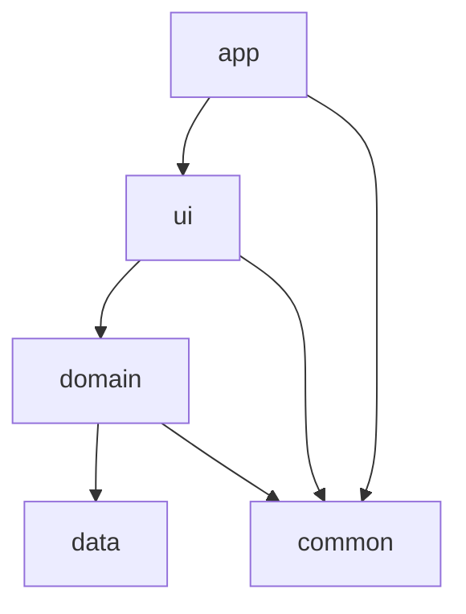
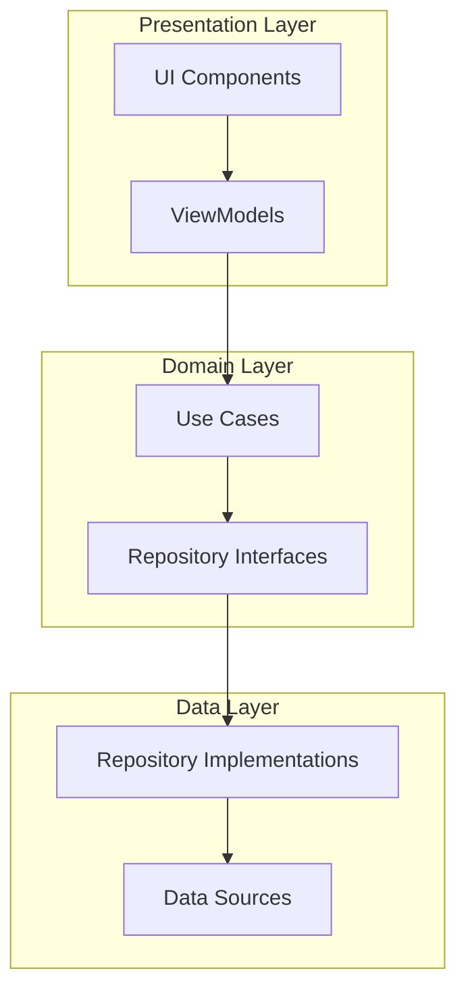
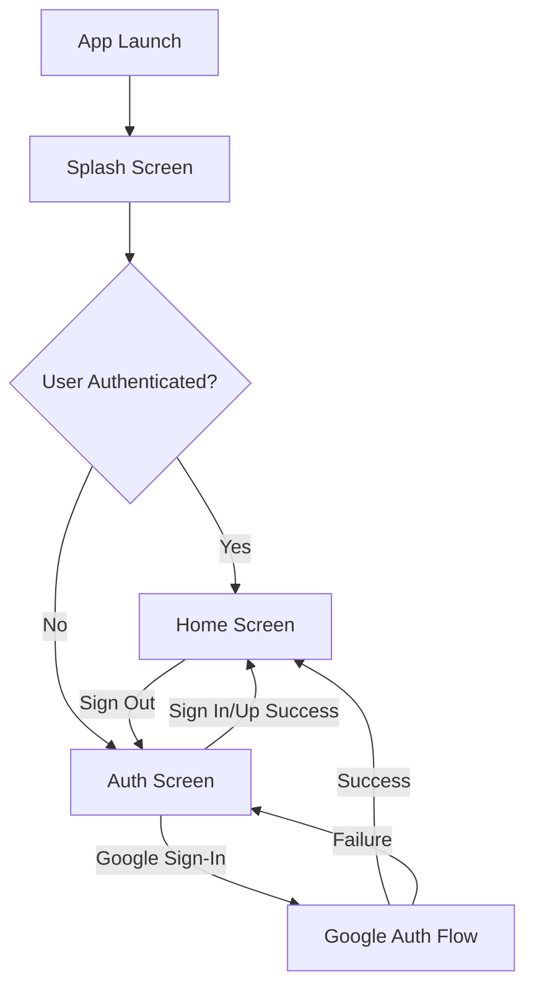
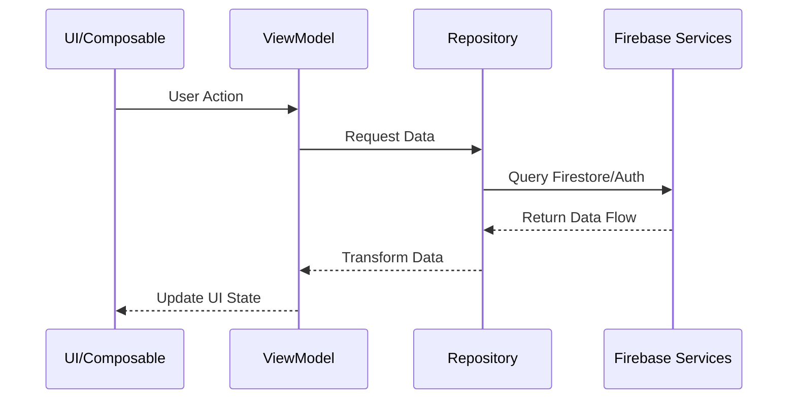
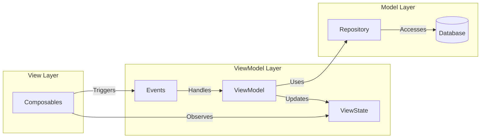
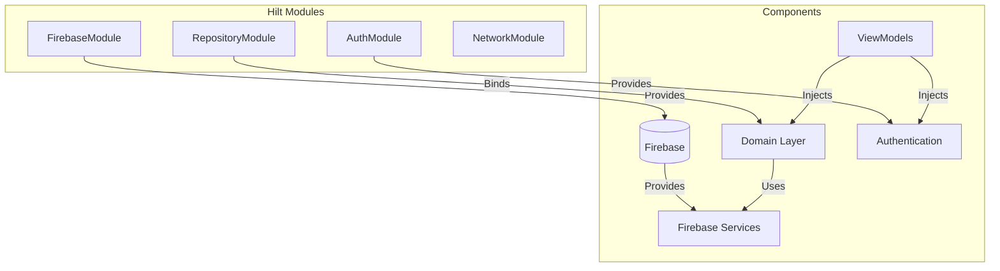

# 🎯 Dingo - Vision Board Bingo App

<div align="center">
  
  
  
  
</div>

## 🎮 Overview
**Dingo** (Bingo + Ding! 🔔) revolutionizes goal achievement by transforming traditional vision boards into an interactive, game-like experience. Combining the excitement of Bingo with the satisfaction of task completion, every goal achieved triggers that rewarding "Ding!" notification.

## 🎯 Purpose
Transform your yearly planning into an engaging, gamified journey where achieving goals becomes as thrilling as winning Bingo. The app empowers users to:
- 📋 **Set & Visualize**: Create yearly goals in an intuitive Bingo-card format
- 📊 **Track Progress**: Monitor achievements with real-time visual feedback  
- 🎉 **Celebrate Success**: Enjoy satisfying notifications and confetti animations
- 🚀 **Stay Motivated**: Maintain momentum through gamification and weekly wrap-ups
- 🌐 **Sync Everywhere**: Access your goals across all devices with Firebase integration

## ✨ Features

### 🔐 Authentication System
Complete user authentication with Firebase integration:
- **Email/Password**: Secure account creation and login
- **Google Sign-In**: One-tap authentication with enhanced error handling
- **Session Management**: Persistent login state across app launches
- **Security**: Firebase Auth backend with proper token handling
- **User Feedback**: Comprehensive error messages and loading states

### 🎯 Goal Management
Transform your goals into an interactive Bingo experience:
- **Visual Goal Cards**: Beautiful, customizable goal representations
- **Status Tracking**: Active, completed, failed, and archived states
- **Drag & Drop**: Intuitive goal reordering with haptic feedback
- **Rich Media**: Custom images, GIFs, and hand-drawn stickers
- **Real-time Sync**: Firebase Firestore for instant cross-device updates

### 🎨 Interactive UI/UX
Engaging interface designed for motivation:
- **Mountain Sunrise Theme**: Custom Material 3 design with gradient backgrounds
- **Confetti Celebrations**: Physics-based animations for goal completions
- **Bubble Animations**: Dynamic scroll effects and visual feedback
- **Responsive Design**: Adaptive layouts for phones and tablets
- **Accessibility**: Sound effects, haptic feedback, and visual cues

### 📊 Progress Tracking
Stay motivated with comprehensive tracking:
- **Weekly Wrap-ups**: Automatic progress summaries with sharing
- **Visual Indicators**: Clear status representation for all goals
- **Statistics**: Completion rates and achievement analytics
- **Gamification**: Bingo-style achievement system

### 🌍 Internationalization
Multi-language support for global users:
- **Dynamic Language Switching**: Change language without restart
- **Localized Content**: Full UI translation (English/Vietnamese)
- **Cultural Adaptation**: Locale-specific formatting and preferences

## Architecture
The project follows Clean Architecture principles with a modular structure:

```
Dingo/
├── app/          # Navigation & DI setup
├── ui/           # UI Components & ViewModels
├── data/         # Data models & local storage
├── domain/   # Data operations & business logic
└── common/       # Shared UI components & utilities
```

### Module Responsibilities
- **:app** - Handles navigation and dependency injection setup
- **:ui** - Contains all screens, ViewModels, and UI state management
- **:data** - Manages Firebase services, data models, and cloud storage
- **:domain** - Implements business logic and data operations
- **:common** - Houses shared components, themes, and utilities

## Design Patterns

### Architectural Patterns
1. **MVVM (Model-View-ViewModel)**
  - Views (Composables) in :ui module
  - ViewModels for state management and business logic
  - Models in :data module

2. **Repository Pattern**
  - Abstract data operations behind repository interfaces
  - Separate data sources from business logic
  - Implemented in :domain module

3. **Dependency Injection**
  - Using Hilt for dependency management
  - Modules scoped appropriately for better testability
  - Clear dependency graph through module boundaries

### Design Patterns Used
1. **Observer Pattern**
  - Using Kotlin Flow for reactive data streams
  - StateFlow for UI state management
  - Firebase real-time listeners for data observations

2. **Factory Pattern**
  - Firebase service initialization
  - ViewModel creation through Hilt

3. **Singleton Pattern**
  - Firebase service instances
  - Repository implementations
  - Application-level components

## SOLID Principles Implementation

1. **Single Responsibility Principle**
  - Each module has a specific responsibility
  - Clear separation between data, UI, and business logic

2. **Open/Closed Principle**
  - Abstract repositories allow for extension
  - Modular design enables adding features without modifying existing code

3. **Liskov Substitution Principle**
  - Repository implementations are substitutable
  - Interface-based design in repositories and ViewModels

4. **Interface Segregation Principle**
  - Specific interfaces for different repository functionalities
  - Separated UI components for reusability

5. **Dependency Inversion Principle**
  - High-level modules depend on abstractions
  - Dependency injection for loose coupling

## 🛠️ Tech Stack

| Category | Technology | Purpose |
|----------|------------|---------|
| **UI Framework** | Jetpack Compose | Modern declarative UI |
| **Navigation** | Navigation Compose | Type-safe navigation |
| **Backend** | Firebase Suite | Authentication, Database, Storage |
| **Database** | Firebase Firestore | Real-time NoSQL database |
| **Storage** | Firebase Storage | Image and media storage |
| **Authentication** | Firebase Auth + Google Sign-In | Secure user management |
| **Dependency Injection** | Hilt | Clean dependency management |
| **Architecture** | Clean Architecture + MVVM | Scalable, testable structure |
| **State Management** | Kotlin Flow + StateFlow | Reactive programming |
| **Image Loading** | Coil | Efficient image loading |
| **Animations** | Konfetti + Custom Compose | Rich visual feedback |
| **Build System** | Gradle (Kotlin DSL) | Modern build configuration |
| **Code Quality** | KtLint | Consistent code formatting |

## Getting Started
1. Clone the repository
2. Open in Android Studio
3. Sync project with Gradle files
4. Configure Firebase Authentication:
  - Add your `google-services.json` to the app module
  - Update the Google Web Client ID in `Constants.kt`
5. Run the app

## Setup & Configuration

### Prerequisites
- Android Studio Hedgehog | 2023.1.1 or newer
- JDK 17
- Android SDK 34
- Kotlin 1.9.0
- Firebase project with Authentication enabled

### Environment Setup
1. Clone the repository:
```bash
git clone https://github.com/yourusername/Dingo.git
```

2. Configure local.properties:
- Create `local.properties` in the project root if it doesn't exist
- Add your Android SDK path:
```properties
sdk.dir=C\:\\Users\\YourUsername\\AppData\\Local\\Android\\Sdk
```

3. Firebase Configuration:
- Create a Firebase project in the Firebase Console
- Enable Authentication with Email/Password and Google Sign-In
- Download `google-services.json` and place it in the app module
- Update the Google Web Client ID in `common/src/main/java/io/sukhuat/dingo/common/Constants.kt`

### Build Configuration
The project uses Gradle Version Catalog for dependency management:

1. Key Dependencies (in `gradle/libs.versions.toml`):
```toml
[versions]
compose-compiler = "1.5.1"
firebase-bom = "32.7.2"
hilt = "2.50"
play-services-auth = "20.7.0"
coil-compose = "2.4.0"

[libraries]
# Core dependencies are managed here
```

2. Module-specific setup:
- **:app**: Main application module with navigation
- **:data**: Firebase services and repository implementations
- **:domain**: Business logic and repository interfaces
- **:ui**: Compose UI components and ViewModels
- **:common**: Shared resources and UI components

### Firebase Setup
Firebase services are configured in the application:
```kotlin
@HiltAndroidApp
class DingoApplication : Application() {
    override fun onCreate() {
        super.onCreate()
        FirebaseApp.initializeApp(this)
        syncManager.startSyncObserver()
    }
}
```

### Dependency Injection
Hilt is configured at the application level:
```kotlin
@HiltAndroidApp
class DingoApplication : Application()
```

### Running Tests
1. Unit Tests:
```bash
./gradlew test
```

2. Instrumented Tests:
```bash
./gradlew connectedAndroidTest
```

### Build Variants
- **debug**: Development build with logging enabled
- **release**: Optimized build with ProGuard rules

### Common Issues & Solutions
1. Build Errors
  - Clean project: `./gradlew clean`
  - Invalid Gradle cache: Delete `.gradle` folder
  - Sync project with Gradle files

2. Firebase Issues
  - Check Firebase configuration and google-services.json
  - Verify Firestore rules and authentication
  - Enable Firebase debugging in logs

3. Compose Preview Issues
  - Invalidate caches / Restart
  - Update Compose compiler version
  - Check module dependencies

### Development Workflow
1. Feature Development
  - Create feature branch
  - Implement in appropriate module
  - Add tests
  - Create pull request

2. Best Practices
  - Follow Clean Architecture
  - Use Composition over Inheritance
  - Write unit tests for ViewModels
  - Document public APIs

### IDE Configuration
Recommended Android Studio settings:
- Enable Compose Preview
- Configure KSP for Hilt
- Set up detekt for static analysis
- Enable compose compiler metrics

## Gradle Commands

### Code Quality
The project uses ktlint for code formatting and various checks. Here are the main Gradle commands:

```bash
# Run all project checks (compilation, lint, tests)
# On Linux/Mac:
./gradlew check
# On Windows:
gradlew.bat check

# Format code using ktlint (fixes most style issues automatically)
# On Linux/Mac:
./gradlew ktlintFormat
# On Windows:
gradlew.bat ktlintFormat

# Verify code formatting
# On Linux/Mac:
./gradlew ktlintCheck
# On Windows:
gradlew.bat ktlintCheck

# One-command fix for most common issues (recommended before committing)
# On Linux/Mac:
./gradlew clean ktlintFormat build
# On Windows:
gradlew.bat clean ktlintFormat build
```

These commands are automatically run as part of the git pre-commit hook to ensure code quality. If you encounter KtLint errors, the `ktlintFormat` command will automatically fix most issues. For more complex problems, check the error reports in the `build/reports/ktlint/` directory.

## Architecture Diagrams

### Module Dependencies


### Clean Architecture Layers


### Authentication Flow Diagram


### Data Flow


### MVVM Implementation


### Dependency Injection Graph


## Future Enhancements
- Custom board creation
- Goal categories
- Progress tracking
- Social sharing
- Achievement notifications
- Statistical analysis

## 📚 Documentation Hub

### 📖 **Comprehensive Guides**
- **[PROJECT_INDEX.md](PROJECT_INDEX.md)** - Complete project overview with detailed architecture
- **[NAVIGATION_INDEX.md](NAVIGATION_INDEX.md)** - Quick navigation and cross-reference guide
- **[CLAUDE.md](CLAUDE.md)** - Development guidelines and Claude Code instructions

### 🎨 **Design System**
- **[Mountain Sunrise Color Palette](mountain_sunrise_color_palette.md)** - Complete color system
- **[UI Mockups](mountain_sunrise_ui_mockup.md)** - Visual design specifications
- **[Style Guide](mountain_sunrise_style_guide.md)** - Design system guidelines

### 🏗️ **Architecture Documentation**
- **[Architecture Patterns](.serena/memories/architecture_patterns.md)** - Architectural guidelines
- **[Coding Conventions](.serena/memories/coding_conventions.md)** - Code style standards
- **[Task Workflows](tasks/)** - Development task tracking

For detailed technical information, component references, and development workflows, see the [PROJECT_INDEX.md](PROJECT_INDEX.md) comprehensive guide.

---

## 🚀 Quick Development Reference

### Key Commands
```bash
./gradlew ktlintFormat build  # Format & build
./gradlew test               # Run tests
./gradlew check             # Full quality check
```

### Module Overview
- **:app** → Navigation & DI setup
- **:ui** → Screens, ViewModels, Compose components
- **:data** → Firebase services, repositories
- **:domain** → Business logic, use cases, models
- **:common** → Shared components, theme system

### Essential Files
- **[MainActivity.kt](app/src/main/java/io/sukhuat/dingo/MainActivity.kt)** - App entry point
- **[HomeScreen.kt](ui/src/main/java/io/sukhuat/dingo/ui/screens/home/HomeScreen.kt)** - Main goal grid
- **[Theme.kt](common/src/main/java/io/sukhuat/dingo/common/theme/Theme.kt)** - Mountain Sunrise theme
- **[Constants.kt](common/src/main/java/io/sukhuat/dingo/common/Constants.kt)** - App configuration
