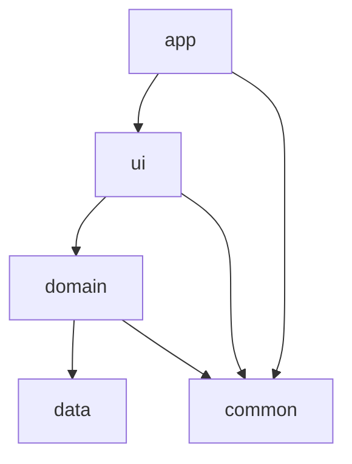
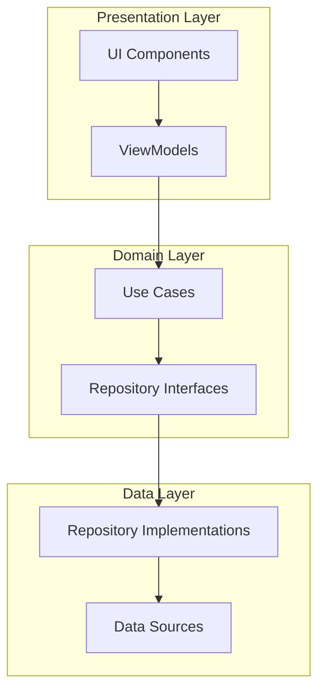
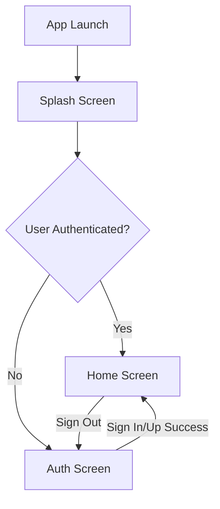
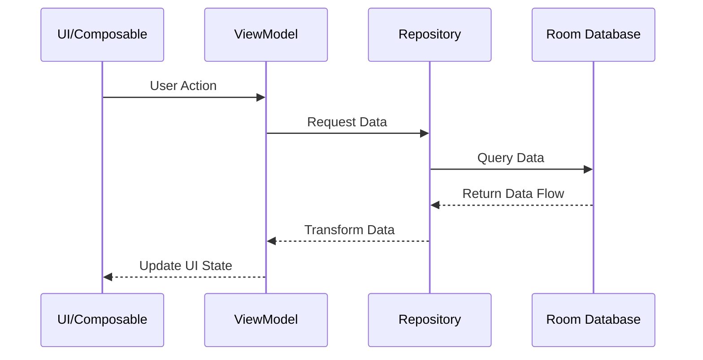
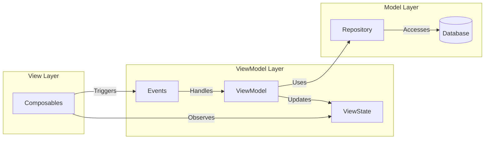
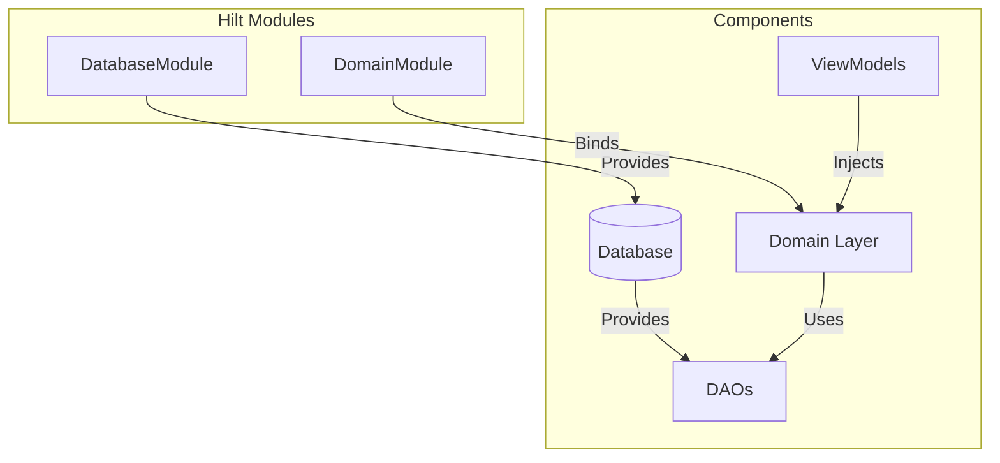

# Dingo - Vision Board Bingo App

## Overview
Dingo (Bingo + Ding! 🔔) is a creative approach to year planning and goal achievement, combining the fun of Bingo with the satisfaction of task completion. When you complete a goal, you get that satisfying "Ding!" notification, making progress tracking both fun and rewarding.

## Purpose
Transform traditional vision boards into an interactive, game-like experience where achieving your yearly goals becomes as engaging as playing Bingo. The app helps users:
- Set and visualize yearly goals
- Track progress in a Bingo-card format
- Celebrate achievements with satisfying notifications
- Stay motivated through gamification

## Features

### Authentication
The app includes a complete authentication system:
- Email/password authentication
- Google Sign-In integration
- Secure session management
- Proper error handling with user feedback

Authentication flow:
1. Splash screen validates user authentication status
2. Users are directed to either the auth screen or home screen based on status
3. Sign-out functionality available from the home screen

## Architecture
The project follows Clean Architecture principles with a modular structure:

```
Dingo/
├── app/          # Navigation & DI setup
├── ui/           # UI Components & ViewModels
├── data/         # Data models & local storage
├── domain/   # Data operations & business logic
└── common/       # Shared UI components & utilities
```

### Module Responsibilities
- **:app** - Handles navigation and dependency injection setup
- **:ui** - Contains all screens, ViewModels, and UI state management
- **:data** - Manages Room database, data models, and local storage
- **:domain** - Implements business logic and data operations
- **:common** - Houses shared components, themes, and utilities

## Design Patterns

### Architectural Patterns
1. **MVVM (Model-View-ViewModel)**
   - Views (Composables) in :ui module
   - ViewModels for state management and business logic
   - Models in :data module

2. **Repository Pattern**
   - Abstract data operations behind repository interfaces
   - Separate data sources from business logic
   - Implemented in :domain module

3. **Dependency Injection**
   - Using Hilt for dependency management
   - Modules scoped appropriately for better testability
   - Clear dependency graph through module boundaries

### Design Patterns Used
1. **Observer Pattern**
   - Using Kotlin Flow for reactive data streams
   - StateFlow for UI state management
   - Room's Flow support for database observations

2. **Factory Pattern**
   - Database instance creation
   - ViewModel creation through Hilt

3. **Singleton Pattern**
   - Database instance
   - Repository implementations
   - Application-level components

## SOLID Principles Implementation

1. **Single Responsibility Principle**
   - Each module has a specific responsibility
   - Clear separation between data, UI, and business logic

2. **Open/Closed Principle**
   - Abstract repositories allow for extension
   - Modular design enables adding features without modifying existing code

3. **Liskov Substitution Principle**
   - Repository implementations are substitutable
   - Interface-based design in repositories and ViewModels

4. **Interface Segregation Principle**
   - Specific interfaces for different repository functionalities
   - Separated UI components for reusability

5. **Dependency Inversion Principle**
   - High-level modules depend on abstractions
   - Dependency injection for loose coupling

## Tech Stack
- **UI**: Jetpack Compose
- **Navigation**: Compose Navigation
- **Database**: Room
- **DI**: Hilt
- **Architecture**: Clean Architecture + MVVM
- **State Management**: Kotlin Flow
- **Authentication**: Firebase Auth, Google Sign-In
- **Build System**: Gradle with Version Catalog

## Getting Started
1. Clone the repository
2. Open in Android Studio
3. Sync project with Gradle files
4. Configure Firebase Authentication:
   - Add your `google-services.json` to the app module
   - Update the Google Web Client ID in `Constants.kt`
5. Run the app

## Setup & Configuration

### Prerequisites
- Android Studio Hedgehog | 2023.1.1 or newer
- JDK 17
- Android SDK 34
- Kotlin 1.9.0
- Firebase project with Authentication enabled

### Environment Setup
1. Clone the repository:
```bash
git clone https://github.com/yourusername/Dingo.git
```

2. Configure local.properties:
- Create `local.properties` in the project root if it doesn't exist
- Add your Android SDK path:
```properties
sdk.dir=C\:\\Users\\YourUsername\\AppData\\Local\\Android\\Sdk
```

3. Firebase Configuration:
- Create a Firebase project in the Firebase Console
- Enable Authentication with Email/Password and Google Sign-In
- Download `google-services.json` and place it in the app module
- Update the Google Web Client ID in `common/src/main/java/io/sukhuat/dingo/common/Constants.kt`

### Build Configuration
The project uses Gradle Version Catalog for dependency management:

1. Key Dependencies (in `gradle/libs.versions.toml`):
```toml
[versions]
compose-compiler = "1.5.1"
room = "2.6.1"
hilt = "2.50"
firebase-auth = "22.3.1"
play-services-auth = "20.7.0"

[libraries]
# Core dependencies are managed here
```

2. Module-specific setup:
- **:app**: Main application module with navigation
- **:data**: Room database configuration
- **:domain**: Data access layer
- **:ui**: Compose UI components
- **:common**: Shared resources

### Database Setup
Room database is configured with auto-migrations:
```kotlin
@Database(
    entities = [DummyData::class],
    version = 1,
    autoMigrations = [AutoMigration(from = 1, to = 2)]
)
```

### Dependency Injection
Hilt is configured at the application level:
```kotlin
@HiltAndroidApp
class DingoApplication : Application()
```

### Running Tests
1. Unit Tests:
```bash
./gradlew test
```

2. Instrumented Tests:
```bash
./gradlew connectedAndroidTest
```

### Build Variants
- **debug**: Development build with logging enabled
- **release**: Optimized build with ProGuard rules

### Common Issues & Solutions
1. Build Errors
   - Clean project: `./gradlew clean`
   - Invalid Gradle cache: Delete `.gradle` folder
   - Sync project with Gradle files

2. Database Issues
   - Clear app data for fresh database
   - Check Room migrations
   - Enable database debugging

3. Compose Preview Issues
   - Invalidate caches / Restart
   - Update Compose compiler version
   - Check module dependencies

### Development Workflow
1. Feature Development
   - Create feature branch
   - Implement in appropriate module
   - Add tests
   - Create pull request

2. Best Practices
   - Follow Clean Architecture
   - Use Composition over Inheritance
   - Write unit tests for ViewModels
   - Document public APIs

### IDE Configuration
Recommended Android Studio settings:
- Enable Compose Preview
- Configure KSP for Hilt
- Set up detekt for static analysis
- Enable compose compiler metrics

## Gradle Commands

### Code Quality
The project uses ktlint for code formatting and various checks. Here are the main Gradle commands:

```bash
# Run all project checks (compilation, lint, tests)
# On Linux/Mac:
./gradlew check
# On Windows:
gradlew.bat check

# Format code using ktlint (fixes most style issues automatically)
# On Linux/Mac:
./gradlew ktlintFormat
# On Windows:
gradlew.bat ktlintFormat

# Verify code formatting
# On Linux/Mac:
./gradlew ktlintCheck
# On Windows:
gradlew.bat ktlintCheck

# One-command fix for most common issues (recommended before committing)
# On Linux/Mac:
./gradlew clean ktlintFormat build
# On Windows:
gradlew.bat clean ktlintFormat build
```

These commands are automatically run as part of the git pre-commit hook to ensure code quality. If you encounter KtLint errors, the `ktlintFormat` command will automatically fix most issues. For more complex problems, check the error reports in the `build/reports/ktlint/` directory.

## Architecture Diagrams

### Module Dependencies


### Clean Architecture Layers


### Authentication Flow Diagram


### Data Flow


### MVVM Implementation


### Dependency Injection Graph


## Future Enhancements
- Custom board creation
- Goal categories
- Progress tracking
- Social sharing
- Achievement notifications
- Statistical analysis

## Key Components

### Authentication
- **AuthScreen**: Composable for login/signup with email/password and Google Sign-In
- **AuthViewModel**: Manages authentication state and operations
- **AuthUiState**: Sealed class representing different authentication states
- **SplashScreen**: Entry point that checks authentication status
- **HomeScreen**: Main screen with logout functionality

### Use Cases
- **SignInUseCase**: Handles email/password authentication
- **SignUpWithEmailUseCase**: Manages user registration
- **GetAuthStatusUseCase**: Checks if user is authenticated
- **SignOutUseCase**: Handles user logout

### Services
- **GoogleAuthService**: Manages Google Sign-In functionality
- **ToastHelper**: Provides consistent toast messages for user feedback

## UI Screens

### Splash Screen
- Validates authentication status on app launch
- Directs users to appropriate screen based on status

### Auth Screen
- Email/password sign-in form
- Email/password registration
- Google Sign-In button
- Error handling with user feedback

### Home Screen
- Main application interface
- Sign-out functionality in top app bar
- User session management

## Error Handling
The app includes comprehensive error handling:
- Descriptive error messages for authentication failures
- Toast notifications for user feedback
- Logging for debugging purposes
- UI state updates to reflect error conditions

## Navigation
- **NavHost**: Manages navigation between screens
- **Screen**: Sealed class defining navigation routes
- Proper back stack management for authentication flow

## Security Considerations
- Secure storage of authentication tokens
- Proper session management
- Firebase Authentication for secure credential handling
- Google OAuth for third-party authentication
