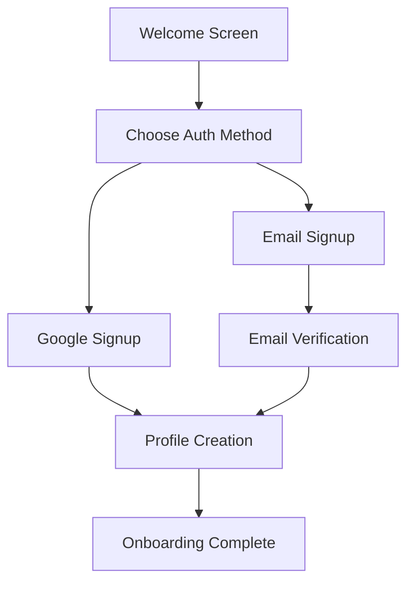
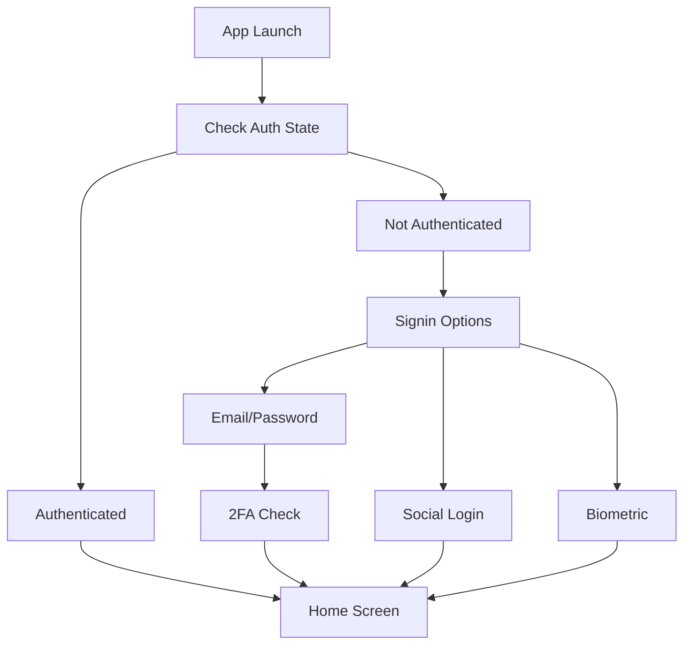
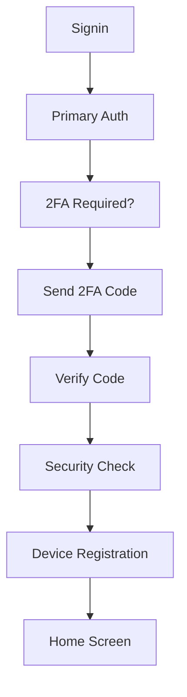

# 🔐 Authentication System PRD
## Dingo - Vision Board Bingo App

---

### **Document Information**
- **Product Name**: Dingo Authentication System
- **Version**: 2.0
- **Last Updated**: January 2025
- **Document Owner**: Product Team
- **Status**: Active Development
- **Parent PRD**: [Main Dingo PRD](../PRD.md)

---

## 🎯 **Executive Summary**

The Dingo Authentication System serves as the secure gateway to users' personal goal achievement journeys. It provides seamless, secure access while maintaining the gamified, engaging experience that defines the Dingo platform. Our authentication system balances security, user experience, and privacy to create a trusted foundation for personal goal management.

### **Vision Statement**
To provide frictionless yet secure authentication that gets users into their goal achievement flow as quickly as possible while maintaining the highest standards of data protection.

### **Mission Statement**
Deliver a best-in-class authentication experience that users trust with their personal goals and progress data, supporting their journey from first signup to long-term engagement.

---

## 🔍 **Current State Analysis**

### **Existing Authentication Features**
Based on codebase analysis, the current implementation includes:

#### ✅ **Implemented Features**
- **Email/Password Authentication**: Complete signup and signin flows
- **Google Sign-In Integration**: OAuth 2.0 integration with Google services
- **Firebase Auth Backend**: Robust cloud authentication service
- **Session Management**: Persistent user sessions across app launches
- **Authentication State Management**: Reactive state management with Kotlin Flow
- **Sign Out Functionality**: Complete session termination
- **Auth Status Checking**: Real-time authentication status monitoring
- **Error Handling**: Comprehensive error states and user feedback

#### ⚠️ **Partially Implemented Features**
- **Account Security**: Password change and account deletion capabilities exist in domain layer
- **Profile Management**: User profile updates and management
- **Data Export**: User data export functionality for privacy compliance

#### ❌ **Missing Features**
- **Password Reset/Recovery**: Email-based password recovery flow
- **Email Verification**: Account verification via email
- **Two-Factor Authentication (2FA)**: Enhanced security option
- **Social Login Options**: Facebook, Apple ID, Twitter integration
- **Account Linking**: Link multiple authentication methods
- **Security Notifications**: Login alerts and security events
- **Advanced Session Management**: Device management and session control

---

## 👥 **User Personas & Authentication Needs**

### **Primary Persona: The Security-Conscious Achiever**
- **Demographics**: 28-35 years old, privacy-aware, tech-savvy
- **Auth Needs**: Strong passwords, 2FA, login notifications, data control
- **Pain Points**: Complex authentication flows, forgotten passwords
- **Motivations**: Data security, privacy control, seamless experience

### **Secondary Persona: The Convenience-First User**
- **Demographics**: 22-30 years old, mobile-native, social media active
- **Auth Needs**: Quick social login, password-free options, minimal friction
- **Pain Points**: Creating new accounts, remembering passwords
- **Motivations**: Speed, convenience, social integration

### **Tertiary Persona: The Privacy-First Individual**
- **Demographics**: 30-45 years old, privacy advocate, cautious adopter
- **Auth Needs**: Minimal data collection, clear privacy controls, local options
- **Pain Points**: Data tracking, unclear privacy policies
- **Motivations**: Data ownership, transparency, control

---

## ✨ **Authentication Feature Roadmap**

### **Phase 1: Core Security Foundation (Current - Weeks 1-4)**

#### 🔐 **Enhanced Email/Password Flow**
**User Story**: *As a user, I want secure and intuitive email/password authentication*

**Requirements**:
- ✅ **Email/Password Signup**: Validated with proper error handling
- ✅ **Email/Password Signin**: Secure credential verification
- ❌ **Email Verification**: Account activation via email link
- ❌ **Password Reset**: Self-service password recovery
- ❌ **Password Strength Validation**: Real-time strength indicators
- ❌ **Account Recovery**: Multiple recovery options (email, security questions)

**Technical Specifications**:
- Email validation using RFC 5322 standards
- Password requirements: 8+ characters, mixed case, numbers, special characters
- Rate limiting: 5 attempts per 15 minutes per IP/device
- Secure password storage using Firebase Auth
- Email verification flow with 24-hour expiration
- Password reset with secure token generation

#### 🎮 **Social Authentication**
**User Story**: *As a user, I want quick authentication using my existing social accounts*

**Current State**:
- ✅ **Google Sign-In**: OAuth 2.0 integration implemented
- ❌ **Apple ID**: iOS ecosystem integration
- ❌ **Facebook Login**: Meta platform integration
- ❌ **Microsoft Account**: Enterprise and consumer integration

**Requirements for Social Auth**:
- Consent-based data collection (name, email, profile picture only)
- Account linking capabilities between social and email accounts
- Graceful handling of cancelled social auth flows
- Privacy-compliant data handling (GDPR, CCPA)

#### 🛡️ **Session & Security Management**
**User Story**: *As a user, I want secure session management and security visibility*

**Requirements**:
- ✅ **Persistent Sessions**: Auto-login on app restart
- ✅ **Session Expiration**: Secure session timeout handling
- ❌ **Device Management**: View and manage authenticated devices
- ❌ **Login History**: Track authentication events
- ❌ **Security Notifications**: Alert users of new logins
- ❌ **Suspicious Activity Detection**: Automated security monitoring

### **Phase 2: Enhanced User Experience (Weeks 5-8)**

#### 🔒 **Two-Factor Authentication (2FA)**
**User Story**: *As a security-conscious user, I want an extra layer of protection*

**Requirements**:
- **SMS-based 2FA**: Phone number verification with OTP
- **Authenticator App Support**: TOTP integration (Google Authenticator, Authy)
- **Backup Codes**: Recovery codes for 2FA device loss
- **2FA Management**: Enable/disable and recovery options

**Technical Implementation**:
- Firebase Phone Auth integration for SMS OTP
- TOTP secret generation and QR code display
- Secure backup code generation and storage
- 2FA requirement enforcement for sensitive operations

#### 📱 **Biometric Authentication**
**User Story**: *As a mobile user, I want quick access using biometric authentication*

**Requirements**:
- **Fingerprint Authentication**: Android Fingerprint API integration
- **Face Recognition**: Android Face Unlock integration
- **Biometric Fallback**: PIN/pattern backup authentication
- **Biometric Settings**: User control over biometric features

**Security Considerations**:
- Biometric data never leaves device
- Secure enclave storage for biometric templates
- Fallback authentication mandatory
- Clear user consent and privacy disclosures

### **Phase 3: Advanced Security & Privacy (Weeks 9-12)**

#### 🔐 **Advanced Security Features**
**User Story**: *As a privacy-focused user, I want maximum security and control*

**Requirements**:
- **End-to-End Encryption**: Client-side encryption for sensitive goal data
- **Zero-Knowledge Architecture**: Server cannot access decrypted user data
- **Security Keys**: Hardware security key support (FIDO2/WebAuthn)
- **Advanced Threat Protection**: ML-based anomaly detection

**Technical Implementation**:
- AES-256 encryption with user-derived keys
- Secure key derivation using PBKDF2/Argon2
- Hardware security module integration
- Behavioral analysis for fraud detection

#### 🛡️ **Privacy & Compliance**
**User Story**: *As a user, I want complete control over my data and privacy*

**Requirements**:
- **Data Portability**: Export all user data in standard formats
- **Right to Deletion**: Complete account and data removal
- **Privacy Dashboard**: Clear overview of data usage and sharing
- **Consent Management**: Granular consent controls
- **Compliance Reports**: GDPR, CCPA compliance documentation

### **Phase 4: Enterprise & Advanced Features (Weeks 13-16)**

#### 🏢 **Enterprise Authentication**
**User Story**: *As an enterprise user, I want SSO and advanced admin controls*

**Requirements**:
- **SAML 2.0 Support**: Enterprise SSO integration
- **LDAP/Active Directory**: Corporate directory integration
- **SCIM Provisioning**: Automated user lifecycle management
- **Admin Dashboard**: User management and analytics

#### 🌐 **Cross-Platform Sync**
**User Story**: *As a multi-device user, I want seamless auth across platforms*

**Requirements**:
- **Web App Authentication**: Browser-based authentication
- **Desktop App Support**: Windows/macOS authentication
- **API Key Management**: Third-party integration authentication
- **Cross-Platform Session Sync**: Unified session management

---

## 🎨 **User Experience Flows**

### **Primary Authentication Flows**

#### **New User Signup Flow**


#### **Returning User Signin Flow**


#### **Security-First Flow**


### **Error Handling & Recovery**

#### **Authentication Error States**
- **Network Errors**: Offline authentication, sync queuing
- **Invalid Credentials**: Clear error messages, account lockout protection
- **Account Issues**: Verification required, account disabled notifications
- **Service Errors**: Firebase outage handling, fallback mechanisms

#### **Recovery Flows**
- **Forgot Password**: Email-based reset with secure tokens
- **Account Locked**: Time-based unlock, admin intervention options
- **2FA Device Lost**: Backup codes, admin recovery, identity verification
- **Email Changed**: Verification of both old and new emails

---

## 🔧 **Technical Architecture**

### **Current Architecture**
```
┌─────────────────┐    ┌─────────────────┐    ┌─────────────────┐
│   UI Layer      │    │  Domain Layer   │    │   Data Layer    │
│                 │    │                 │    │                 │
│ • AuthScreen    │ ───│ • AuthRepository│ ───│ • FirebaseAuth  │
│ • AuthViewModel │    │ • Use Cases     │    │ • GoogleAuth    │
│ • Auth States   │    │ • Auth Models   │    │ • Local Storage │
└─────────────────┘    └─────────────────┘    └─────────────────┘
```

### **Enhanced Architecture (Target)**
```
┌─────────────────┐    ┌─────────────────┐    ┌─────────────────┐
│   UI Layer      │    │  Domain Layer   │    │   Data Layer    │
│                 │    │                 │    │                 │
│ • Multi-Auth UI │ ───│ • Auth Use Cases│ ───│ • Firebase Auth │
│ • Biometric UI  │    │ • Security Logic│    │ • Social OAuth  │
│ • 2FA Interface │    │ • Privacy Engine│    │ • Biometric API │
│ • Admin Console │    │ • Compliance    │    │ • Secure Storage│
└─────────────────┘    └─────────────────┘    └─────────────────┘
                              │
                    ┌─────────────────┐
                    │ Security Layer  │
                    │                 │
                    │ • Encryption    │
                    │ • Key Management│
                    │ • Threat Defense│
                    │ • Audit Logging │
                    └─────────────────┘
```

### **Security Implementation**

#### **Data Protection**
- **Encryption at Rest**: AES-256 for local storage
- **Encryption in Transit**: TLS 1.3 for all communications
- **Key Management**: Android Keystore for secure key storage
- **Data Minimization**: Collect only necessary authentication data

#### **Threat Mitigation**
- **Brute Force Protection**: Exponential backoff, account lockout
- **Session Hijacking Prevention**: Token rotation, secure cookies
- **Man-in-the-Middle Prevention**: Certificate pinning, HSTS
- **Social Engineering Protection**: Security awareness, verification flows

---

## 📊 **Success Metrics & KPIs**

### **User Experience Metrics**
- **Signup Completion Rate**: >85% (from start to verified account)
- **Signin Success Rate**: >95% (successful authentication attempts)
- **Authentication Time**: <3 seconds average signin time
- **Password Reset Success**: >90% successful password reset completion
- **User Satisfaction**: 4.5+ rating for authentication experience

### **Security Metrics**
- **Account Compromise Rate**: <0.1% of total accounts
- **Suspicious Activity Detection**: 99%+ accuracy with <5% false positives
- **2FA Adoption Rate**: >40% of active users within 6 months
- **Security Incident Response Time**: <1 hour for critical issues
- **Compliance Score**: 100% GDPR, CCPA compliance

### **Technical Performance Metrics**
- **Authentication Uptime**: 99.9% service availability
- **Error Rate**: <1% authentication errors
- **API Response Time**: <500ms for authentication requests
- **Concurrent User Support**: 100,000+ simultaneous authentications
- **Data Breach Incidents**: Zero tolerance target

### **Business Impact Metrics**
- **User Retention**: 10% improvement in 7-day retention with enhanced auth
- **Premium Conversion**: 15% higher conversion rate with social login
- **Support Ticket Reduction**: 30% fewer auth-related support requests
- **Trust Score**: 90%+ users rate authentication as "very secure"

---

## 🚨 **Risk Assessment & Mitigation**

### **Security Risks**

| Risk | Impact | Probability | Mitigation Strategy |
|------|--------|-------------|-------------------|
| **Data Breach** | Critical | Low | Multi-layer encryption, zero-knowledge architecture |
| **Account Takeover** | High | Medium | 2FA enforcement, suspicious activity monitoring |
| **Social Engineering** | High | Medium | Security education, multi-factor verification |
| **API Vulnerabilities** | High | Low | Security audits, penetration testing, rate limiting |
| **Third-party Service Compromise** | High | Low | Diversified auth providers, fallback systems |

### **User Experience Risks**

| Risk | Impact | Probability | Mitigation Strategy |
|------|--------|-------------|-------------------|
| **Authentication Friction** | Medium | High | Progressive enhancement, optional advanced security |
| **Password Fatigue** | Medium | High | Social login options, biometric authentication |
| **Account Recovery Difficulty** | High | Medium | Multiple recovery options, clear documentation |
| **Privacy Concerns** | High | Medium | Transparent privacy policy, user data controls |

### **Technical Risks**

| Risk | Impact | Probability | Mitigation Strategy |
|------|--------|-------------|-------------------|
| **Firebase Service Outage** | High | Low | Offline authentication, multiple auth providers |
| **Mobile OS Changes** | Medium | Medium | Platform abstraction, regular SDK updates |
| **Compliance Violations** | Critical | Low | Regular compliance audits, legal review |
| **Performance Degradation** | Medium | Medium | Performance monitoring, optimization cycles |

---

## 🎯 **Implementation Phases**

### **Phase 1: Security Foundation (Weeks 1-4)**
**Deliverables**:
- ✅ Enhanced email/password authentication
- ❌ Email verification system
- ❌ Password reset functionality  
- ❌ Basic security monitoring

**Success Criteria**:
- 95% authentication success rate
- <3 second average authentication time
- Zero critical security vulnerabilities

### **Phase 2: User Experience Enhancement (Weeks 5-8)**
**Deliverables**:
- Two-factor authentication (SMS + Authenticator app)
- Biometric authentication (fingerprint, face)
- Social login expansion (Apple ID, Facebook)
- Improved error handling and user feedback

**Success Criteria**:
- 30% 2FA adoption rate
- 60% social login usage
- 4.5+ user satisfaction rating
- 50% reduction in authentication-related support tickets

### **Phase 3: Advanced Security (Weeks 9-12)**
**Deliverables**:
- End-to-end encryption implementation
- Advanced threat detection
- Privacy dashboard and controls
- Compliance documentation and auditing

**Success Criteria**:
- Zero data breach incidents
- 100% compliance audit pass rate
- 99.9% service uptime
- Advanced security features adoption >20%

### **Phase 4: Enterprise & Scale (Weeks 13-16)**
**Deliverables**:
- Enterprise SSO integration
- Advanced admin controls
- Cross-platform authentication
- Performance optimization

**Success Criteria**:
- Support for 100,000+ concurrent users
- Enterprise client acquisition
- Cross-platform feature parity
- <100ms authentication response time

---

## 🔒 **Privacy & Compliance**

### **Data Collection Principles**
- **Minimization**: Collect only data necessary for authentication
- **Consent**: Clear, granular consent for all data collection
- **Transparency**: Open documentation of data usage
- **Control**: User control over data sharing and deletion

### **Compliance Framework**
- **GDPR (EU)**: Full compliance with data protection regulation
- **CCPA (California)**: California Consumer Privacy Act compliance  
- **COPPA (US)**: Children's privacy protection for users under 13
- **PIPEDA (Canada)**: Personal Information Protection compliance
- **SOC 2 Type II**: Security audit compliance for enterprise

### **Privacy Features**
- **Data Export**: Complete user data export in JSON format
- **Data Deletion**: Complete account and data removal within 30 days
- **Anonymization**: Option to anonymize data instead of deletion
- **Audit Logs**: Complete audit trail of data access and modifications

---

## 📈 **Analytics & Monitoring**

### **Authentication Analytics Dashboard**
- **Real-time Authentication Volume**: Live authentication attempt monitoring
- **Success/Failure Rates**: Authentication outcome tracking
- **Geographic Distribution**: Login location and pattern analysis
- **Device and Platform Analytics**: Authentication method popularity
- **Security Event Timeline**: Suspicious activity and threat detection

### **User Behavior Analytics**
- **Authentication Flow Analytics**: Drop-off points and completion rates
- **Feature Adoption Tracking**: 2FA, biometric, social login usage
- **User Journey Mapping**: From signup to long-term engagement
- **Cohort Analysis**: Authentication method impact on retention

### **Security Monitoring**
- **Threat Detection Alerts**: Real-time suspicious activity notifications
- **Vulnerability Scanning**: Automated security assessment
- **Compliance Monitoring**: Ongoing regulatory compliance tracking
- **Incident Response Metrics**: Security incident resolution tracking

---

## 🚀 **Future Vision**

### **Next-Generation Authentication (2+ Years)**
- **Passwordless Authentication**: FIDO2/WebAuthn standard adoption
- **Behavioral Biometrics**: Typing patterns, device usage analysis
- **AI-Powered Security**: Machine learning threat detection and prevention
- **Blockchain Identity**: Decentralized identity verification
- **Quantum-Resistant Cryptography**: Post-quantum security preparation

### **Innovation Opportunities**
- **Voice Authentication**: Voice biometric integration
- **Continuous Authentication**: Ongoing identity verification during session
- **Privacy-Preserving Analytics**: Differential privacy implementation
- **Zero-Trust Architecture**: Never trust, always verify security model
- **Decentralized Identity**: User-owned identity and credentials

---

## 📋 **Acceptance Criteria**

### **Phase 1 Acceptance Criteria**
- [ ] Email verification system with 24-hour token expiration
- [ ] Password reset via email with secure token generation  
- [ ] Password strength validation with real-time feedback
- [ ] Rate limiting: max 5 authentication attempts per 15 minutes
- [ ] Comprehensive error handling with user-friendly messages
- [ ] Security event logging and basic monitoring

### **Phase 2 Acceptance Criteria**
- [ ] SMS-based 2FA with OTP delivery
- [ ] Authenticator app integration (TOTP)
- [ ] Biometric authentication (fingerprint + face)
- [ ] Social login expansion (Apple ID + Facebook)
- [ ] Backup code generation and management
- [ ] Device registration and management

### **Phase 3 Acceptance Criteria**
- [ ] End-to-end encryption for sensitive user data
- [ ] Privacy dashboard with data usage transparency
- [ ] GDPR/CCPA compliance documentation
- [ ] Advanced threat detection and response
- [ ] Security audit trail and reporting
- [ ] User data export/deletion capabilities

### **Phase 4 Acceptance Criteria**
- [ ] Enterprise SSO integration (SAML 2.0)
- [ ] Cross-platform authentication synchronization
- [ ] Admin dashboard for user management
- [ ] Performance optimization for 100,000+ concurrent users
- [ ] API key management for third-party integrations
- [ ] Advanced analytics and reporting dashboard

---

*This Authentication PRD serves as the comprehensive guide for Dingo's authentication system development, ensuring security, usability, and compliance while supporting the platform's goal achievement mission.*